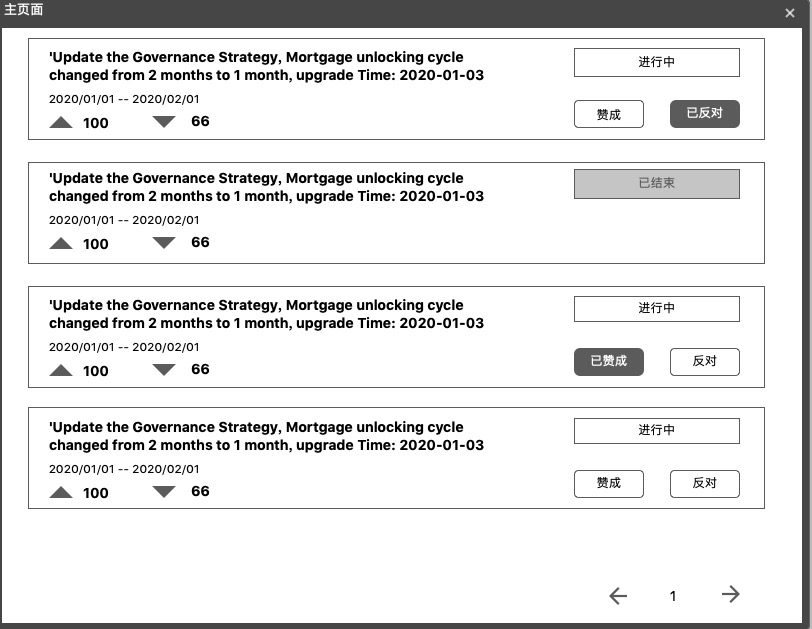

# Vote合约Owallet需求

## Vote合约介绍
社区就某一个Topic进行投票的合约。当Ontology进行重大升级时，需要社区对该升级进行投票表决，同时，为了方便社区参与到Ontology的治理，开发了该合约。


## 升级需求

1. 到了截止日期， 不能取消投票
2. 用 ontid 来发起投票和投票

## Vote合约角色设计
* 超级管理员，有权利设置哪些地址是管理员
* 管理员，有权利发起一个Topic,并设置哪些地址可以针对该Topic进行投票
* 投票地址，投票地址可以针对其有投票权的Topic进行投票，不同地址有不同的投票权重，以抵押的Ont数量计算。

## 投票流程设计
### 超级管理员的流程
1. 部署合约
2. 调用合约的`init`方法，初始化投票合约，该方法仅能调用一次
3. 超级管理员设置哪些地址为管理员，调用`setAdmin`方法，该方法可以重复调用。

### 管理员和投票人的流程
1. 管理员调用`createTopic`方法发起一个Topic,该管理员也被称为该Topic的creator，监听合约中推送的事件，从中提取中Topic Hash，每个Topic对应一个唯一的hash值
2. 管理员调用`setVoterForTopic` 方法为其自己创建的Topic设置哪些地址可以投票以及每个地址的投票权重，投票权重应该以地址抵押的ont数量来计算
3. 被授权投票的地址可以参与投票，调用合约中的`voteTopic`方法对某个Topic进行投票，每个Topic的投票结果会根据投票地址的权重进行累加

## 展示页面设计
### 管理员界面
1. 管理员入口界面


2. 当前管理员创建的所有Topic展示页面


显示信息介绍
* Topic Topic详细描述信息
* 开始时间 Topic开始的时间
* 结束时间 Topic结束的时间
* 赞成的票数，反对的票数
* Topic状态 未开始，已取消，进行中，已结束，
* 终止按钮，用于终止某个Topic


3. 管理员发起Topic页面


显示信息介绍
* Topic Topic详细描述信息
* 开始时间 Topic开始的时间
* 结束时间 Topic结束的时间
* 投票用户 可以设置哪些地址可以投票，目前仅支持节点用户可投票

### 主页面设计


显示信息介绍
* Topic内容
* 投票开始时间和结束时间
* 赞成总票数和反对总票数
* 投票状态，进行中还是已结束
* 我的状态，未授权，未投票，已赞成，已反对
  按钮显示规则
  未授权    approve按钮会置灰    reject按钮会置灰
  未投票    approve按钮会置亮    reject按钮会置亮
  已赞成    approve按钮会置灰    reject按钮会置亮
  已反对    approve按钮会置亮    reject按钮会置灰

> 优先显示正在进行中的Topic,其次是未开始的，最后是已完成的

### Topic详情页设计

显示信息介绍
* Topic Topic详细内容
* Hash Topic Hash值，具有唯一性，用来标识唯一的Topic
* Creator 该Topic的创建者地址
* Time Topic投票开始时间到投票结束时间
* Status Topic的状态，未开始，投票中，已结束
* My Votes 我的票数，应该是抵押的ont的数量
* 赞成按钮和反对按钮
  按钮显示规则
  未授权    approve按钮会置灰    reject按钮会置灰
  未投票    approve按钮会置亮    reject按钮会置亮
  已赞成    approve按钮会置灰    reject按钮会置亮
  已反对    approve按钮会置亮    reject按钮会置灰
* Topic 票数统计信息包含投票者地址和投票者票数(权重)，分别显示赞成的总票数和反对的总票数


## Vote合约具体接口设计

1. def init()  not need
合约初始化方法
SuperAdmin 有权调用，其他人不能调用

2. def setAdmin(admins)   not need
SuperAdmin设置哪些地址是Admin.
参数介绍
* admin: 地址数组，例如：['AbtTQJYKfQxq4UdygDsbLVjE8uRrJ2H3tP','Ac9JHT6gFh6zxpfv4Q7ZPLD4xLhzcpRTWt']

3. def listAdmins() 
查询哪些地址是Admin,所有用户均可调用

返回值例子：
```
["AT4fXp36Ui22Lbh5ZJUCRBFDJ7axkLyUFM"]
```

4. def createTopic(admin, topic_title, topic_detail, startTime, endTime)
Admin针对Ontology重大治理升级事件发起一个Topic，并设置该Topic投票开始时间和结束时间，到达开始时间自动开始投票，到达结束时间自动结束投票。
参数介绍
* admin Address, 第2个接口设置的管理员地址均可以调用该方法
* topic_title String, 重大治理升级的标题，例如：'Update the Governance Strategy, Mortgage unlocking cycle changed from 2 months to 1 month',
* topic_detail String, 重大治理升级的详细描述信息，例如：'Update the Governance Strategy, Mortgage unlocking cycle changed from 2 months to 1 month, upgrade Time: 2020-01-03 11:02:18UST'
* startTime u32, Unix时间戳,用来设定该Topic的投票开始时间
* endTime u32, Unix时间戳,用来设定该Topic的投票结束时间


该方法执行成功的时候会推送事件，其中包含该Topic的hash值(也是该交易的hash)，接下来的操作会用到该值。事件格式["createTopic", "hash", "topic_title", "topic_detail"],
事件例子
```
["637265617465546f706963","f6e0a1e2ac41945a9aa7ff8a8aaa0cebc12a3bcc981a929ad5cf810a090e11ae","31","3131"]
```

5. def setVoterForTopic(hash, voters)   not need
Topic的发起人有权调用该方法设置哪些地址可以对该事件进行投票。

参数介绍：
* hash bytearray Topic hash 是`createTopic`方法执行成功后推送出来的值
* voters 地址和权重数组， 不同地址都有不同的投票权重，例如：[['AbtTQJYKfQxq4UdygDsbLVjE8uRrJ2H3tP',100000],['Ac9JHT6gFh6zxpfv4Q7ZPLD4xLhzcpRTWt',100000]]

6. def listTopics()  
列出所有的Topic hash值，所以返回值是hash值数组，注意该方法仅返回hash值数组，而不返回Topic具体内容。

返回值示例
```
["76a8cd9be66550c338051000d158da701f3be67bd11391db579e699c2928abbb"]
```

7. def getTopic(hash)
根据Topic hash值 查询Topic具体内容
参数介绍
* hash H256, Topic hash值


返回值是Option<Topic>, option表示该值可以为空
```
struct Topic {
    topic_title: Vec<u8>,  //字节数组
    topic_detail: Vec<u8>, 
}
```

* 序列化规则
如果查不到数据，序列化false
如果查到数据，序列化true,然后序列化topic结构体


返回值示例


8. def getTopicInfo(hash)

根据Topic hash 查询TopicInfo, 包括[admin, topic, voter address,startTime, endTime, approve amount, reject amount, state, topic hash]

参数介绍
* hash bytearray, Topic hash值
返回值介绍
Option<TopicInfo>

TopicInfo struct字段信息
```
struct TopicInfo {
    admin: Address,
    topic_title: Vec<u8>, //字节数组
    topic_detail: Vec<u8>,
    voters: Vec<VoterWeight>, //自定义结构体
    start_time: u64,
    end_time: u64,
    approve: u64,
    reject: u64,
    status: u8,
    hash: H256, //长度为32的字节数组
}
```

* [admin, topic, voter address,startTime, endTime, approve amount, reject amount, status]
   * admin Topic的创建者
   * topic_title Topic标题
   * topic_detail Topic详细描述信息
   * voter address VoterWeight数组,被授权投票的地址和权重的数组
   * startTime 该Topic投票开始时间
   * endTime， 该Topic投票结束时间
   * approve amount， 该Topic赞成者的总量，是赞成者权重的累加
   * reject amount， 该Topic反对者的总量，是反对者权重的累加
   * status， 该Topic的状态，0表示已取消，1表示正常
   * topic hash

返回值示例
```
 ["dca1305cc8fc2b3d3127a2c4849b43301545d84e","31","3131",[["dca1305cc8fc2b3d3127a2c4849b43301545d84e","e803000000000000"],["df6fd120388b8bb62b4792a8fe76f8f8d69f4527","e803000000000000"]],"01","01","00","00","01", "c5c03df1206eae087ae5613d296e2e1a9277a04cbb3a4f4e292e0ae821afda08"]
```

9. def getVoters(hash)  not need   用listAdmins代替
根据Topic hash 查询该Topic的所有被授权的投票者地址
参数介绍
hash bytearray, Topic hash

返回值是地址和权重的二维数组，示例如下
```
[["dca1305cc8fc2b3d3127a2c4849b43301545d84e","e803000000000000"],["df6fd120388b8bb62b4792a8fe76f8f8d69f4527","1027000000000000"]]
```
10. def voteTopic(hash, voter, approveOrReject)
voter对hash对应的Topic进行投票，在投票结束时间之前可以修改自己的投票，例如：Voter对Topic1第一次投赞成票，然后想修改成反对票，直接调用该方法投反对票即可。
参数介绍
* hash bytearray, Topic hash
* voter, Address, 投票者地址
* approveOrReject, boolean, true表示赞成，false表示反对
该方法执行成功会推送事件，事件格式["voteTopic", "hash", "voter"]

Event示例
```
["766f7465546f706963","c5c03df1206eae087ae5613d296e2e1a9277a04cbb3a4f4e292e0ae821afda08","dca1305cc8fc2b3d3127a2c4849b43301545d84e"]
```

11. getVotedInfo(hash, addr)
根据hash值和地址查询投票信息
返回值，1表示赞成，2表示反对，其他值表示尚未投票

12. getVotedAddress(hash)
根据TopicHash查询已经投过该Topic的地址和投票内容, 1表示赞成，2表示反对，其他表示未投票。

返回值是 VotedInfo数组
```
struct VotedInfo {
    voter: Address,
    weight: u64,
    approve_or_reject: bool,
} 
```
返回值拿到的是hex需要反序列化


13. cancelTopic(hash)
根据Topic Hash 设置Topic状态为0，0表示Topic失效， 1表示Topic正常，状态为0的Topic，Owallet就不要显示了

14. getTopicInfoListByAdmin(admin)
根据admin查询该admin发起的所有Topic，返回值是TopicInfo的数组，TopicInfo各个字段的意思请看getTopicInfo中的介绍
返回值 TopicInfo数组
```
struct TopicInfo {
    admin: Address,
    topic_title: Vec<u8>,
    topic_detail: Vec<u8>,
    voters: Vec<VoterWeight>,
    start_time: u64,
    end_time: u64,
    approve: u64,
    reject: u64,
    status: u8,
    hash: H256,
}
```

